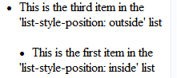

# XML - css
Recordar:
* Si en el css pongo 2 veces la misma etiqueta y en cada una un mismo estilo ej `font-size: <numero><unidad>` se va quedar con la ultima. El resto de estilos respectivos en cada una de ellas que no sean iguales se aplican.
````css
titulo, autor {
	display: block; /*se aplica a titulo*/
	margin-left: 20px; /*se aplica a tit*/
	font-size: 3em; /*NO se aplica a tit*/
}

titulo {
	text-shadow: 4px 5px blue; /*se aplica a tit*/
	font-size: 2em; /*se aplica a tit*/
}
````
* Los id y los class en xml no funciona en todos los navegadores.

Añadir hoja de estilos (css) a xml
```css
<?xml-stylesheet type='text/css' href='boletin22.css'?>
```
## Listas

```css
display: list-item; 
list-style-type: disc; /*circulos negros*/
```

```css
list-style:  disc inside;
list-style:  disc outside; /*creo que se escribe asi*/
```


## Listas indentadas
En algunos navegadores si los indentamos puede que haya conflictos, por tanto utilizamos otro metodo:

Ejemplo 1

ej 1.1. 

El `counter-reset` lo tengo que poner siempre en alguna de las etiquetas aunque sea la más externa ya que si no no se incrementarán los valores.
```css
edificio{
	display: block; 
	counter-reset: contador; 
	margin-bottom: 10px;
}
```
cada vez que llega a esta etiqueta se resetea el que hemos denominado como "contador" 

ej 1.2. 

si fuera `nombre:after{content:"<loQueQuieresQueAparezca>";)}` apareceria despues.
```css
nombre:before, ciudad:before, completado:before{ /* indico que antes de esas etiqueta hagan lo que tiene en el cuerpo */
	content: counter(contador, lower-alpha)". ";  /*cuerpo*/
```
 `content` para generar contenido que no aparece en el xml pero en el css si.

 `contador` es el nombre que le hemos denominado al `counter`.

 `lower-alpha` enumeracion en letras. 
 
 con `upper-alpha` enumeracion en mayus (A\nB\n...)
 
 `". "` despues de la letra añade un punto y un espacio.

ej 1.3. 

`list-style: lower-alpha inside;` si pusieramos esto en las siguientes etiquetas 
haría exactamente los mismo que hicimos de forma manual con le contador. El problema es que
cuando está indentado pueden aparecer conflictos.
```css
}
nombre, ciudad, completado{
	display: block;
	margin-left: 40px;
	counter-increment: contador; /* incrementamos el "counter" en cada una de las etiquetas */
	list-style-type: none; /* para que no me aplique estilos aqui, asi evitamos posibles
	errores */
}
```
lo de `none` creo no lo entiendo muy bien porque quitando ese estilo me aparece igual. preguntar????

## Tablas
````css
display: table; /*creas la tabla*/
display; table-row; /*creas las fias*/
display: table-cell; /*creas las columnas*/ 
border-spacing: 2px; /*separar etiqueta del borde que lo rodea*/
````

## Margenes
```css
margin-left: 5em; /*izq*/ 
margin-top: 10px;
margin-bottom: 10px; /*de abajo*/
padding: 10px; /*margen interno*/

```

## Otros
```css
display: block; /*da un enter <br>*/
*{ /*se aplica a todas las etiquetas*/
}

```

## Letra
```css
font-weight: bolder; /*negrita*/
font-size: 2em; /*tamaño*/
autor::first-letter {font-size: 2em;} /*primera letras mas grande*/
text-indent: -15px /*sangria*/
text-transform: uppercase; /*convierte a mayuscula*/
text-decoration: underline; /*subraya*/
```

## Contenido
```css
display:  none;	 /*no muestra el contenido de las etiquetas*/
```

## Tamaños
````css
3px /*pixeles*/
3em /*realtivo*/
-3em
````
