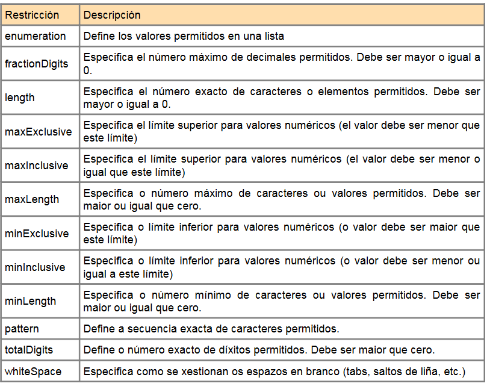

# Tipos Simples

# Elemento simple

Un elemento simple es un elemento XML que contiene solamente texto. No puede contener ni
otros elementos ni atributos.

```xml
<!---->
<xs:element name="nomElemento" type="tipoDato"/>

<!--VALORES POR DEFECTO vs FIJOS-->
<xs:element name="color" type="xs:string" default="azul"/> <!--no se especifica 
otro valor-->
<xs:element name="color" type="xs:string" fixed="azul"/> <!--asig autom a ele y 
no se puede especificar otro valor diferente-->
```

MODELO GENERICO:

```xml
	<xs:element name="empleado">
		<xs:complexType>
			<!-- modelo de contenido del empleado va aquí -->
		</xs:complexType>
	</xs:element>
```

# Atributos XSD

TODOS los atributos declarados como TIPOS simples

Los elementos simples NO puedes contener atributos → si ele tiene atributos = elemento complejo

```xml
<xs:attribute name="nomAtributo" type="tipoDato"/>
```

```xml
<!--PROTOTIPO-->
<xs:complexType name="tipo_evento">
  <xs:attribute name="nombre" type="xs:string" use="required"/>
  <xs:attribute name="activo" type="xs:boolean" default="false"/>
</xs:complexType>

<!---NO SSE SI ESTA BIEN ESTO, YA QUE CREO QUE UN ELEMENTO
CON ATRIBUTOS SE CONSIDERA COMPLEJO Y NO SIMPLE?????-->
<xs:element name="produto">
  <xs:complexType> <!--el atributo no era un tipo complejo??-->
    <xs:attribute name="prodid" type="xs:integer"/>
  </xs:complexType>
</xs:element>

<!--atributo opcional vs obligatorio -> utilizar atributo "use" -->
<xs:attribute name="idioma" type="xs:string" use="optional"/>
```

# Restricciones XSD



1. Restricciones en valores
    
    Ejemplo: El valor de la edad no puede ser menor que 0 o mayor que 120:
    
    ```xml
    <xs:element name="edad">
    	<xs:simpleType>
    		<xs:restriction base="xs:integer"> <!--restricion-->
    			<xs:minInclusive value="0"/>
    			<xs:maxInclusive value="120"/>
    		</xs:restriction>
    	</xs:simpleType>
    </xs:element>
    ```
    
2. Restricciones en un conjunto de valores
    
    para limitar conjunto de valores aceptables
    
    Ejemplo, en este código definimos un elemento llamado "coche" con una restricción. Los únicos
    
    valores aceptables son: BMW, Audi, Golf:
    
    ```xml
    <xs:element name="coche"> <!--elemento condicionado-->
    	<xs:simpleType> <!--PRINCIPIO delaracion restriccion = tipo simple-->
    		<xs:restriction base="xs:string"> <!--tipo restriccion-->
    			<xs:enumeration value="BMW"/>
    			<xs:enumeration value="Audi"/>
    			<xs:enumeration value="Golf"/>
    		</xs:restriction> <!-- se acaban conjunto de restricciones-->
    	</xs:simpleType> <!--FINAL-->
    </xs:element> <!--cierra etiqueta del ele condicionado-->
    ```
    
3. Restricciones en una serie de valores
    
    limitar serie de numeros/letras
    
    ```xml
    <!--EJEMPLO 1: Se define el elemento letra con una restricción. Los únicos valores 
    aceptables son UNA das letras del abecedario entre a-z (en minúsculas):-->
    <xs:element name="letra">
    	<xs:simpleType>
    		<xs:restriction base="xs:string">
    			<xs:pattern value="[a-z]"/> 
    		</xs:restriction>
    	</xs:simpleType>
    </xs:element>
    
    <!--EJEMPLO 2: elemento llamado "iniciales" con una restricción. El único valor
    aceptado son 3 letras en mayúsculas desde a hasta z:-->
    <xs:element name="iniciales">
    	<xs:simpleType>
    		<xs:restriction base="xs:string">
    			<xs:pattern value="[A-Z][A-Z][A-Z]"/>
    		</xs:restriction>
    	</xs:simpleType>
    </xs:element>
    
    <!--EJEMPLO 3: Solamente se aceptan 3 letras en mayúsculas o 
    minúsculas desde a hasta z:-->
    <xs:element name="iniciales">
    	<xs:simpleType>
    		<xs:restriction base="xs:string">
    			<xs:pattern value="[a-zA-Z][a-zA-Z][a-zA-Z]"/>
    		</xs:restriction>
    	</xs:simpleType>
    </xs:element>
    
    <!--EJEMPLO 4: Solamente se acepta UNA
    de las siguientes letras: x, y o z:-->
    <xs:element name="opcion">
    	<xs:simpleType>
    		<xs:restriction base="xs:string">
    			<xs:pattern value="[xyz]"/>
    		</xs:restriction>
    	</xs:simpleType>
    </xs:element>
    
    <!--solo aceptar 5 digitos en secuencia y cada uno en el rango: 0-9-->
    <xs:restriction base="xs:integer">
    	<xs:pattern value="[0-9][0-9][0-9][0-9][0-9]"/>
    </xs:restriction>
    
    <!--acepta letras del abecedario. pueden no haber ninguna letras o muchas-->
    <xs:pattern value="([a-z])*"/>
    
    <!--solo ademite 8 digitos: letras de la a-z (mayus y minus) y/o num de 0 a 9-->
    <xs:pattern value="[a-zA-Z0-9]{8}"/>
    ```
    
4. Limitaciones de longitud
    
    Se pueden limitar la longitud de los valores de los elementos y atributos:
    
    ```xml
    <!-- limita la longitud del valor del elemento "nombre" a 
    un máximo de 50 caracteres-->
    <xs:element name="nombre">
        <xs:simpleType>
            <xs:restriction base="xs:string">
                <xs:maxLength value="50"/>
            </xs:restriction>
        </xs:simpleType>
    </xs:element>
    
    <xs:minLength value="5" /> <!--limitacion limite de caracteres-->
    <xs:length value="8"/> <!--debe tener exactamente ese num de carac-->
    ```
    
5. Numericos general
    
    ```xml
    <!--numero exacto de digitos permitidos, su valor tiene debe ser >0-->
    <xs:simpleType>
    	<xs:restriction base="xs:integer">
    		<xs:totalDigits value="6"/>
    	</xs:restriction>
    </xs:simpleType>
    
    <!--2 numeros decimales-->
    <xs:element name="altura">
      <xs:simpleType>
        <xs:restriction base="xs:decimal">
          <xs:fractionDigits value="2"/>
        </xs:restriction>
      </xs:simpleType>
    </xs:element>
    
    <!--solo valores decimales/enteros especificos-->
    <xs:simpleType>
    	<xs:restriction base="xs:decimal"> <!--solo con que haya uno, HAY QUE PONERLO-->
    		<xs:enumeration value="1"/>
    		<xs:enumeration value="2"/>
    		<xs:enumeration value="3"/>
    		<xs:enumeration value="3"/>
    		<xs:enumeration value="5.3"/> 
    	</xs:restriction>
    </xs:simpleType>
    
    <!--valor numérico más alto permitido (29, porque el 30 es el máximo)-->
    <xs:simpleType>
    	<xs:restriction base='xs:integer'>
    	  <xs:maxExclusive value='30'/> <!--valor max 29-->
    	</xs:restriction>
    </xs:simpleType>
    
    <!--número más alto permitido (30)-->
    <xs:element name='precio'>
     <xs:simpleType>
      <xs:restriction base='xs:decimal'>
        <xs:maxInclusive value='30'/> <!--max 30-->
      </xs:restriction>
     </xs:simpleType>
    </xs:element>
    
    <xs:minExclusive value='10'/>
    <xs:minInclusive value='10'/>
    ```
    

No está del todo bien creo:

[apuntesSchema.txt](masInfo/apuntesSchema.txt)

Tampoco esta del todo bien, pero se irá actualizando

[xsd.pdf](masInfo/xsd.pdf)
